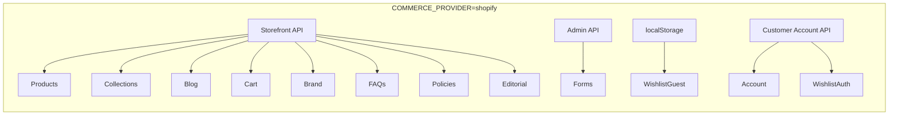
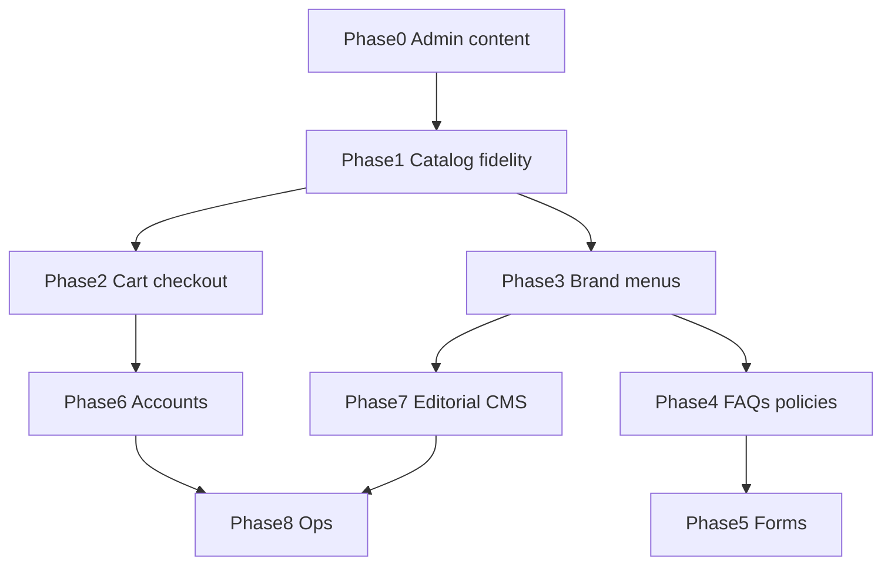

# Shopify-Driven Storefront Roadmap

Priority-ordered plan to move the GULRIZA Next.js headless storefront from mock/hardcoded content to **Shopify as the single source of truth** — catalog, navigation, brand, cart/checkout, CMS pages, and customer features.

Related docs:

- [Commerce layer](./commerce-layer.md) — architecture and env toggle
- [Shopify store setup](./shopify-store-setup.md) — tokens, CLI, verification
- [Storefront API reference](./shopify-storefront-api-reference.md) — queries, mutations, scopes mapped to code

---

## How to update this document

When a phase (or sub-task) is finished:

1. Change **Status** from `pending` → `done` (or `in_progress` while active).
2. Add a **Completed** subsection under that phase with:
   - **Date** (YYYY-MM-DD)
   - **What was done** (bullets — Admin, app code, env)
   - **Verify** (commands or URLs checked)
3. If only part of a phase shipped, keep status `in_progress` and list done items under **Completed (partial)**.

Status values: `pending` | `in_progress` | `done`

---

## Progress at a glance

| Phase | Name | Status | Notes |
|-------|------|--------|-------|
| — | [Pre-roadmap infrastructure](#pre-roadmap-infrastructure) | **partial** | Connection + UX; not full Shopify catalog |
| 0 | [Foundation & content migration](#phase-0--foundation-and-content-migration) | **done** | Catalog, images, journal seeded |
| 1 | [Catalog fidelity](#phase-1--complete-catalog-fidelity) | **done** | Colors, tags, collectionSlug |
| 2 | [Cart & checkout](#phase-2--cart-and-checkout) | **done** | Storefront Cart API, httpOnly cookie, checkoutUrl, inventory UX |
| 3 | [Brand, nav, footer](#phase-3--global-chrome-brand-nav-footer) | **done** | Storefront menus + shop metafields |
| 4 | [FAQs & policies](#phase-4--trust-policies-and-faqs) | **done** | Metaobject FAQs + shop policies + footer URLs |
| 5 | [Newsletter & contact](#phase-5--forms-newsletter-and-contact) | **done** | Admin customerCreate + consent |
| 6 | [Accounts & wishlist](#phase-6--customer-accounts-and-wishlist) | **done** | Customer Account OAuth PKCE, orders, wishlist metafield |
| 7 | [Editorial CMS pages](#phase-7--editorial-cms-pages) | **done** | Homepage hero, Our Story, Craftsmanship, journal hero |
| 8 | [Markets & operations](#phase-8--polish-and-operations) | pending | |

---

## Pre-roadmap infrastructure

**Status:** partial

Work completed before formal phase tracking (app + dev setup, not full Shopify content).

### Completed (partial)

- **Date:** 2026-06-19
- **What was done:**
  - Shopify Storefront API connected (`SHOPIFY_STORE_DOMAIN`, `SHOPIFY_STOREFRONT_ACCESS_TOKEN` in `.env.local`)
  - `pnpm verify:shopify` script ([`scripts/verify-shopify-connection.mjs`](../scripts/verify-shopify-connection.mjs))
  - [Shopify store setup guide](./shopify-store-setup.md)
  - Editorial homepage: stacked collection hero + product preview ([`HomeCollectionSections`](../src/components/site/HomeCollectionSections.tsx))
  - `/collections` redirects to `/#collections`; collection detail at `/collections/[slug]`
  - Mock catalog aligned to [purekashmir.com](https://purekashmir.com/) collections: Jamawar Embroidery, Kani Pashmina, Reversible Cashmere
  - Collection-scoped filters (color, price range from products on page)
- **Verify:** `pnpm dev:mock` for full UI; `pnpm verify:shopify` for API; `pnpm dev:shopify` (catalog empty until Phase 0 Admin content)

---

## Current state (baseline)

### On Shopify today (Phases 0–7)

- Products, collections, blog articles, search, sitemap, related products
- Homepage collection sections via [`getHomepageCollectionSections()`](../src/lib/commerce/homepage-collections.ts)
- Homepage hero, value props, marquee, legacy, quote via app metaobjects + [`getHomepageEditorial()`](../src/lib/commerce/shopify/editorial.ts)
- Our Story, Craftsmanship, journal index hero via app metaobjects + shop metafields
- Cart & checkout — Storefront Cart API, httpOnly `cartId` cookie, `checkoutUrl` redirect
- Brand, nav, footer — shop metafields + Storefront menus (falls back to `brandConfig` when unseeded)
- FAQs — app metaobject `$app:faq` (falls back to `mockFaqs` when unseeded or API error)
- Shop policies — PDP Shipping & Returns accordions; footer privacy/terms via Shopify-hosted policy URLs
- Newsletter + contact — Admin `customerCreate` / consent / notes (requires `SHOPIFY_ADMIN_ACCESS_TOKEN` at runtime)

### Still deferred

- Optional standalone `/privacy`, `/terms` Next.js routes (footer links use Shopify policy URLs)

---

## What Shopify can drive vs what stays in Next.js

| Area | Drive from Shopify | Stays in Next.js |
|------|-------------------|------------------|
| Products | title, handle, description, images, price, variants, availability, tags, `productType`, metafields | PDP layout, accordions shell, JSON-LD template |
| Collections | title, handle, description, image, sort order, products | Hero/preview layout; metafields for extra hero lines |
| Filters (color/price) | variant options + prices from collection products | Filter UI in [`ProductListing`](../src/components/site/ProductListing.tsx) |
| Homepage collection blocks | collections + preview products | — |
| Homepage main hero, marquee, legacy, quote | app metaobjects | Page layout, icon mapping |
| Journal | blog articles, `bodyHtml`, images, tags | Index hero from shop metafields |
| Header / footer nav | [Menu API](https://shopify.dev/docs/api/admin-graphql/latest/queries/menus) | Header/Footer components |
| Brand | shop metafields + Files (logo) | Fonts, CSS, markup |
| Cart | [Storefront Cart API](https://shopify.dev/docs/api/storefront/latest/mutations/cartCreate) | [`CartDrawer`](../src/components/site/CartDrawer.tsx) UI |
| Checkout | `cart.checkoutUrl` → hosted checkout | Redirect only |
| Account / orders | Customer Account API | [`AccountClient`](../src/components/site/AccountClient.tsx) |
| FAQs | Metaobjects | Accordion UI |
| Our Story / Craftsmanship | app metaobjects | Page templates under `app/` |
| Sitemap / SEO | live handles + `NEXT_PUBLIC_SITE_URL` | `generateMetadata` templates |

**Cannot be Shopify-driven:** React layout, Tailwind, routes, filter UI logic, custom checkout UI.

---

## Shopify Admin setup (Phase 0 prerequisite)

Create in Admin (handles = URL slugs):

| Collection handle | Title |
|-------------------|-------|
| `jamawar-embroidery` | Jamawar Embroidery |
| `kani-pashmina` | Kani Pashmina |
| `reversible-cashmere` | Reversible Cashmere |

- Publish products to **Online Store / Headless**
- Blog handle: `news` (`SHOPIFY_BLOG_HANDLE`)
- **Collection metafields** (`custom`): `hero_headline`, `hero_tagline`, `cta_label`
- **Product metafields** (optional): `care_instructions`, `dimensions`, `product_highlights`, `shipping_returns_text`, `authenticity_promise`
- **Shop metafields** (global PDP): `authenticity_promise`, `shipping_badge_text`, `returns_badge_text`
- **Variant option:** Color (for filter swatches in Phase 1)

### API access by phase

| Phase | API | Env var |
|-------|-----|---------|
| Catalog | Storefront | `SHOPIFY_STOREFRONT_ACCESS_TOKEN` |
| Menus, policies, metaobjects | Admin GraphQL | `SHOPIFY_ADMIN_ACCESS_TOKEN` |
| Customer login | Customer Account API | `SHOPIFY_CUSTOMER_ACCOUNT_CLIENT_ID` (+ secret, callback URLs) |

---

## Phase 0 — Foundation and content migration

**Status:** done

**Goal:** Live Shopify store matches the editorial model; app reads real catalog data.

### Shopify Admin tasks

- [x] Create 3 collections + flagship products (see mock in [`products.ts`](../src/lib/commerce/mock/data/products.ts)) — `pnpm seed:shopify`
- [x] Upload collection hero images and product media
- [x] Write collection descriptions (homepage hero + collection page)
- [x] Create journal articles in blog `news`
- [x] Define collection metafields in Admin (`custom.hero_headline`, `hero_tagline`, `cta_label`)
- [x] Publish catalog to **Online Store** + **Headless** (required for Storefront API)

### App tasks

- [x] Extend [`mapShopifyCollection`](../src/lib/commerce/shopify/mappers.ts) for metafields → `heroHeadline`, `tagline`, `ctaLabel`
- [x] Add metafield fragments to [`queries.ts`](../src/lib/commerce/shopify/queries.ts)
- [x] Seed script: [`scripts/seed-shopify-catalog.mjs`](../scripts/seed-shopify-catalog.mjs) + `pnpm seed:shopify`

### Verify

- `pnpm verify:shopify` — expect 3 collections, 9+ products
- `pnpm dev:shopify`
- Homepage `#collections`, `/collections/kani-pashmina` with live products

### Completed

- **Date:** 2026-06-20
- **What was done:**
  - Collection hero images via staged upload (`COLLECTION_IMAGE`) + `collectionUpdate` — fixed bare GCS `resourceUrl` by appending upload `key`
  - Product media on all 9 flagship products (skip re-upload when media already present)
  - Journal blog `news` + 3 articles with body HTML, excerpts, and cover images
  - Storefront article queries include `tags` → category mapping in `mapShopifyArticle`
  - `pnpm verify:shopify` extended — checks collection hero images, product media, blog articles
- **Verify:** `pnpm verify:shopify` → 3 collections (3 with images), 9 products (9 with images), blog `news` (3 articles); `pnpm seed:shopify`

### Completed (partial)

- **Date:** 2026-06-19
- **What was done:**
  - Collection metafield definitions + Storefront queries/mappers for hero copy
  - `pnpm seed:shopify` — 3 collections, 9 flagship products, prices, Headless publication
  - Verify script reports collection + product counts
- **Verify:** `pnpm verify:shopify` → 3 collections; Storefront returns metafields on `jamawar-embroidery`

---

## Phase 1 — Complete catalog fidelity

**Status:** done

**Goal:** Every catalog surface uses accurate Shopify data; no mock fallbacks on shopping paths.

### Tasks

| Task | Files | Shopify source | Status |
|------|-------|----------------|--------|
| Map variant colors to filters | `shopify/mappers.ts`, `queries.ts` | `product.options` / `selectedOptions` / swatches | done |
| Related products (not mock) | `shopify/provider.ts` | same collection / `productRecommendations` | done |
| Dynamic sitemap | `shopify/provider.ts` | live handles | done |
| `collectionSlug` on products | mappers | collection membership | done |
| `categoryLabel` from tags / `productType` | mappers | tags / productType | done |
| PDP metafields (care, dimensions) | `ProductClient.tsx`, queries | product metafields | done |
| Journal categories from tags | `JournalClient.tsx`, journal detail | article tags | done |

### Completed (partial)

- **Date:** 2026-06-19
- **What was done:**
  - `deriveListingFacets()` — colors and price range derived from products on the current page
  - Collection pages: hide global category/collection filters; scope color + price to collection products
  - Default max price uses collection min/max (not global $1,000 cap)
- **Verify:** `pnpm dev:mock` → `/collections/kani-pashmina` shows collection-specific swatches and price slider

### Completed (partial)

- **Date:** 2026-06-20
- **What was done:**
  - PDP copy from Shopify: `product_highlights`, `care_instructions`, `dimensions`, optional per-product overrides
  - Shop metafields for global PDP badges + authenticity promise (`custom.shipping_badge_text`, `returns_badge_text`, `authenticity_promise`)
  - `getRelatedProducts` — same-collection products from Storefront API (no mock delegate)
  - `getSitemapEntries` — live product/collection/article handles
  - `ProductClient` — no hardcoded accordion/bullet copy when `COMMERCE_PROVIDER=shopify`
  - Seed: `pnpm seed:shopify` creates new metafield definitions + shop metafields
- **Verify:** Storefront returns highlights on `mustard-jamawar-embroidery-pashmina`; `pnpm dev:shopify` → `/product/mustard-jamawar-embroidery-pashmina`

### Completed

- **Date:** 2026-06-20
- **What was done:**
  - **Variant colors:** `PRODUCT_FRAGMENT` fetches `options` (with swatches) + variant `selectedOptions`; `mapShopifyProduct` maps `colorHex` + `colorName` from Color option (hex map → swatch → deterministic hash; `#bcb6ad` only when no Color option)
  - **Filters / swatches:** `deriveListingFacets` uses `product.colorName`; shop + collection pages skip mock `commerceColors` when `COMMERCE_PROVIDER=shopify`
  - **`collectionSlug`:** verified on shop listing, search, PDP via `collections(first: 1)` on product fragment
  - **`categoryLabel`:** `productType` first, then collection handle label, then category enum display label
  - **Journal:** index filter tabs + article sidebar categories derived from article tags (`mapShopifyArticle` first tag); `?category=` deep link on index
  - **Verify script:** Phase 1 checks for Color option, collection membership, productType, article tags
  - **Shop legal policies (complete):** All four standard policies seeded via Admin `shopPolicyUpdate` — `SHIPPING_POLICY`, `REFUND_POLICY`, `TERMS_OF_SERVICE`, `PRIVACY_POLICY`. Partner app scopes: `write_legal_policies`, `read_privacy_settings`, `write_privacy_settings` (deploy + re-install if `ACCESS_DENIED`). Privacy policy requires disabling Shopify auto-management first (`privacyFeaturesDisable(PRIVACY_POLICY)` — handled in seed script). Run `pnpm seed:shopify -- --policies-only`; verify with `pnpm verify:shopify:policies`. Storefront returns all four policy bodies; PDP Shipping & Returns accordion uses shipping + refund HTML via `getShopPolicies()` → `resolveProductDetailContent()`.
- **Verify:** `pnpm lint`; `pnpm verify:shopify` → Phase 1 fidelity line; `pnpm dev:shopify` → `/shop`, `/collections/kani-pashmina`, `/journal`, PDP color swatches

---

## PDP content strategy

Agreed split between Shopify (content) and Next.js (UI shell). Applies to PDP and trust surfaces through Phases 3–4.

| Layer | Owner | Examples |
|-------|-------|----------|
| Merchandising & trust copy | **Shopify** | `description`, product/shop metafields, shop policies, highlights, badges |
| Layout & interaction | **Next.js** | Accordion shell, icons, qty caps, add-to-cart, cart drawer |

**Still hardcoded in Next.js (Phase 6+):**

- Accordion **titles** and other PDP UI labels (e.g. “Description”, “Shipping & Returns”) — optional Phase 3 extension via shop metafields
- Homepage hero, Our Story, Craftsmanship (Phase 7)

**Optional cleanup (when reached):** Remove duplicate inline product description above the accordions if the Description accordion already shows the same Shopify `description` HTML.

---

## Phase 2 — Cart and checkout

**Status:** done

**Goal:** Real bag → Shopify hosted checkout.

### Tasks

- [x] Storefront Cart API (`cartCreate`, `cartLinesAdd`, `cartLinesUpdate`, `cartLinesRemove`)
- [x] Persist `cartId` in httpOnly cookie
- [x] Replace localStorage cart in [`commerce-context.tsx`](../src/lib/commerce/client/commerce-context.tsx) with `variantId` + line IDs
- [x] Checkout button → `cart.checkoutUrl` in [`CartDrawer.tsx`](../src/components/site/CartDrawer.tsx)
- [x] Server cart actions in `src/lib/commerce/shopify/cart.ts`
- [x] Subtotal from cart `cost` fields

**Shopify scopes:** `unauthenticated_write_checkouts`, `unauthenticated_read_checkouts`

**Optional scope (inventory):** `unauthenticated_read_product_inventory` — enables `quantityAvailable` on PDP and cart line caps; degrades gracefully without it (see [`inventory-scope.ts`](../src/lib/commerce/shopify/inventory-scope.ts)).

### Completed

- **Date:** 2026-06-20
- **What was done:**
  - **Cart module:** [`cart.ts`](../src/lib/commerce/shopify/cart.ts), [`cart-queries.ts`](../src/lib/commerce/shopify/cart-queries.ts), [`cart-cookie.ts`](../src/lib/commerce/shopify/cart-cookie.ts) — create/load cart, line mutations, httpOnly cookie persistence
  - **Server actions + client context:** cart actions in [`actions.ts`](../src/lib/commerce/actions.ts); [`commerce-context.tsx`](../src/lib/commerce/client/commerce-context.tsx) branches on `COMMERCE_PROVIDER` (Shopify cart vs mock localStorage)
  - **CartDrawer:** checkout redirect via `cart.checkoutUrl`; subtotals from Storefront cart `cost` fields (not client-side math)
  - **Inventory UX:** `quantityAvailable` on products/variants; cart quantity warnings; seed uses `inventoryPolicy: DENY`; mock catalog includes low-stock examples via [`inventory.ts`](../src/lib/commerce/inventory.ts)
  - **Errors & toasts:** [`cart-errors.ts`](../src/lib/commerce/cart-errors.ts); Sonner toasts top-center ([`sonner.tsx`](../src/components/ui/sonner.tsx))
  - **Storefront scope note:** `unauthenticated_read_product_inventory` optional for full PDP qty caps — works without it, caps hidden when scope missing
- **Verify:** `pnpm dev:shopify` (add to cart → checkout redirect); `pnpm build:mock`; `pnpm build:shopify`

---

## Phase 3 — Global chrome: brand, nav, footer

**Status:** done

**Goal:** Header, footer, contact, SEO editable in Shopify without deploys.

**Reference:** [Storefront API reference](./shopify-storefront-api-reference.md) · Storefront [`menu`](https://shopify.dev/docs/api/storefront/latest/queries/menu) (reads) · Admin [`menuCreate`](https://shopify.dev/docs/api/admin-graphql/latest/mutations/menuCreate) (seed writes)

| Surface | Shopify | App |
|---------|---------|-----|
| Header nav | Storefront `menu(handle: "main-menu")` | `getShopifyBrand()` → `headerNav` |
| Footer menus | Storefront `menu(handle: "footer")` nested items | `footerMenus` |
| Logo | shop metafield `custom.logo_url` | `brand.logo` (static fallback) |
| Name, tagline, contact, social, SEO | shop metafields + `shop.name` | `BrandConfig` |
| Newsletter copy | shop metafields | `brand.newsletter` (submit via Admin API — Phase 5) |
| Privacy / Terms links | `shop.privacyPolicy.url`, `shop.termsOfService.url` | Footer `<a>` (Shopify-hosted policy URLs) |

Menu links are seeded with Next.js routes (`/shop`, `/#collections`, `/collections/…`), not theme URLs. Falls back to [`brandConfig`](../src/lib/commerce/brand/config.ts) when menus or metafields are missing.

**Requires:** Storefront token (read); Admin `write_online_store_navigation` for seed (`pnpm seed:shopify`). Brand cached ~300s via `unstable_cache`.

**Phase 3 extension (optional):** PDP UI strings, breadcrumbs, and accordion **titles** could move to shop metafields — see [PDP content strategy](#pdp-content-strategy).

### Completed

- **Date:** 2026-06-20
- **What was done:**
  - **Storefront brand read:** [`brand.ts`](../src/lib/commerce/shopify/brand.ts) — `getShopifyBrand()` merges `SHOP_BRAND_QUERY` (shop metafields, policy URLs, menus) with `brandConfig` for `copy.pages` templates
  - **Provider:** [`shopify/provider.ts`](../src/lib/commerce/shopify/provider.ts) `getBrand()` → cached Shopify brand (mock unchanged)
  - **Queries:** extended [`SHOP_CONTEXT_QUERY`](../src/lib/commerce/shopify/queries.ts) + `SHOP_BRAND_QUERY` with brand metafields; Storefront `menu(handle:)` for `main-menu` and `footer`
  - **Seed:** 18 shop metafield definitions/values + navigation menus in [`seed-shopify-catalog-data.mjs`](../scripts/seed-shopify-catalog-data.mjs) / [`seed-shopify-catalog.mjs`](../scripts/seed-shopify-catalog.mjs) (`menuCreate` / `menuUpdate`, graceful skip if scope missing)
  - **Verify:** `pnpm verify:shopify` reports brand metafields + menu link counts
  - **Header/Footer:** unchanged components — already consume `brand` from commerce context
- **Verify:** `pnpm build:mock`; `pnpm build:shopify`; `pnpm verify:shopify`
- **Admin menus:** Online Store → Navigation → menus `main-menu`, `footer` (after seed)
- **Blocker note:** Partner app needs `write_online_store_navigation` to seed menus; without it, app falls back to `brandConfig` nav

---

## Phase 4 — Trust, policies, and FAQs

**Status:** done

**Goal:** FAQs and legal/trust copy from Admin.

| Content | Shopify source | Consumer | Status |
|---------|----------------|----------|--------|
| FAQs | Metaobject `$app:faq` | `/faqs`, `getFaqs()` | **done** |
| Shipping / returns | Shop policies | PDP accordions | **done** (seeded + wired) |
| Privacy / Terms | `shop.privacyPolicy.url`, `shop.termsOfService.url` | Footer links | **done** (Shopify-hosted policy URLs) |

Shop legal policies (all four types) are seeded and consumed on PDP Shipping & Returns accordions (Phase 1). Footer privacy/terms links use Storefront policy URLs via `getShopifyBrand()` → `brand.legal` (falls back to `#` only in mock mode or when policies are unseeded).

### Completed

- **Date:** 2026-06-20
- **What was done:**
  - App-owned FAQ metaobject `$app:faq` (question, answer, show_on_faq_page) in partner app `shopify.app.toml` with `access.storefront = "public_read"`
  - Storefront `metaobjects` query + [`getShopifyFaqs()`](../src/lib/commerce/shopify/faqs.ts); `getFaqs()` in Shopify provider with `brandText` token interpolation
  - Seed: 6 FAQ entries via `metaobjectUpsert` in [`seed-shopify-catalog-data.mjs`](../scripts/seed-shopify-catalog-data.mjs); `pnpm seed:shopify -- --faqs-only`
  - Partner app scopes: `read_metaobjects`, `write_metaobjects`, `unauthenticated_read_metaobjects`
  - All four shop policies seeded (`SHIPPING_POLICY`, `REFUND_POLICY`, `TERMS_OF_SERVICE`, `PRIVACY_POLICY`) via `pnpm seed:shopify -- --policies-only`
  - PDP Shipping & Returns accordion uses shipping + refund policy HTML via `getShopPolicies()`
  - Footer privacy/terms links: `SHOP_BRAND_QUERY` → `getShopifyBrand()` maps `shop.privacyPolicy.url` and `shop.termsOfService.url` to `brand.legal` (Shopify checkout-hosted URLs; `#` only when mock provider or policies unseeded)
- **Verify:** `pnpm verify:shopify`; `pnpm verify:shopify:policies` (policy bodies + footer URLs); `/faqs` and footer links with `pnpm dev:shopify`
- **Optional later:** Standalone `/privacy`, `/terms` Next.js routes rendering policy HTML on-site

---

## Phase 5 — Forms: newsletter and contact

**Status:** done

**Goal:** Submissions reach merchant workflows.

| Form | Implementation |
|------|----------------|
| Newsletter | Admin `customerCreate` / `customerEmailMarketingConsentUpdate` + tag `newsletter` |
| Contact | Admin `customerCreate` / `customerUpdate` + tag `contact-form` + appended note |

Wire [`subscribeNewsletterAction`](../src/lib/commerce/actions.ts) and `submitContactAction` in Shopify provider via [`forms.server.ts`](../src/lib/commerce/shopify/forms.server.ts) + [`admin.ts`](../src/lib/commerce/shopify/admin.ts). Requires Admin API access via `SHOPIFY_ADMIN_ACCESS_TOKEN` or `SHOPIFY_PARTNER_APP_DIR` + Shopify CLI (`read_customers` + `write_customers`).

### Completed

- **Date:** 2026-06-20
- **What was done:**
  - **Newsletter:** `subscribeShopifyNewsletter()` — validates email, creates customer with `emailMarketingConsent: SUBSCRIBED` or updates existing via `customerEmailMarketingConsentUpdate`; tag `newsletter`
  - **Contact:** `submitShopifyContact()` — creates/updates customer with appended note (name, email, subject, message) and tag `contact-form`
  - **Admin client:** [`admin.ts`](../src/lib/commerce/shopify/admin.ts) — server-side Admin GraphQL via token or `shopify app execute` fallback
  - **Provider:** [`shopify/provider.ts`](../src/lib/commerce/shopify/provider.ts) — replaced mock delegate for forms
  - **Partner app scopes:** `read_customers`, `write_customers` in `shopify.app.toml`
  - **Docs:** [shopify-store-setup.md](./shopify-store-setup.md) — customer scopes + Admin token setup for forms
- **Verify:** `pnpm verify:shopify` (no admin-token warning); `pnpm dev:shopify` → footer newsletter + `/contact` form; check **Shopify Admin → Customers** for new records/tags

---

## Phase 6 — Customer accounts and wishlist

**Status:** done

**Goal:** Login, orders, saved items.

- OAuth PKCE (Customer Account API)
- Order history / profile
- Wishlist via customer metafield; guest localStorage until login

**Env:** `SHOPIFY_CUSTOMER_ACCOUNT_CLIENT_ID` (+ optional `SHOPIFY_CUSTOMER_ACCOUNT_CLIENT_SECRET`); callback/logout URLs must match `NEXT_PUBLIC_SITE_URL`

**Admin setup:** Headless → Customer Account API — register redirect `{SITE_URL}/api/auth/customer/callback`, logout `{SITE_URL}/account`, JavaScript origin `{SITE_URL}`. Seed `custom.wishlist` customer metafield via `pnpm seed:shopify`.

Replaces demo UI in [`AccountClient.tsx`](../src/components/site/AccountClient.tsx).

### Completed

- **Date:** 2026-06-20
- **What was done:**
  - **Customer Account OAuth:** PKCE login/callback/logout routes under `app/api/auth/customer/`; discovery from `/.well-known/openid-configuration`; httpOnly session cookies with refresh
  - **Account UI:** [`AccountClient.tsx`](../src/components/site/AccountClient.tsx) — Shopify sign-in, profile, order history; mock mode keeps demo form
  - **Wishlist sync:** guest `localStorage`; logged-in customers persist `custom.wishlist` JSON metafield via Customer Account API `metafieldsSet`; merge on login in [`commerce-context.tsx`](../src/lib/commerce/client/commerce-context.tsx)
  - **Server actions:** `getCustomerSessionAction`, `getCustomerOrdersAction`, wishlist merge/toggle actions in [`actions.ts`](../src/lib/commerce/actions.ts)
  - **Seed:** `customerMetafieldDefinitions` (`custom.wishlist`, type `json`, `customerAccount: READ_WRITE`) in [`seed-shopify-catalog-data.mjs`](../scripts/seed-shopify-catalog-data.mjs)
- **Verify:** `pnpm build:mock`; `pnpm build:shopify`; configure Customer Account API client in Admin, then `pnpm dev:shopify` → `/account` sign-in → orders; toggle wishlist guest + after login

---

## Phase 7 — Editorial CMS pages

**Status:** done

**Goal:** Marketing copy and images editable in Shopify.

| Section | Approach |
|---------|----------|
| Homepage collection blocks | collections + products (Storefront) |
| Homepage main hero, marquee, legacy, quote | app metaobjects |
| Our Story | app metaobject `$app:our_story` |
| Craftsmanship | app metaobjects + steps list |
| Journal index hero | shop metafields |

### Completed

- **Date:** 2026-06-20
- **What was done:**
  - App metaobject types in partner app `shopify.app.toml`: `homepage_hero`, `homepage_value_prop`, `homepage_marquee_item`, `homepage_legacy`, `homepage_quote`, `our_story`, `craftsmanship`, `craftsmanship_step`
  - Storefront query [`EDITORIAL_CONTENT_QUERY`](../src/lib/commerce/shopify/queries.ts) + mapper [`editorial.ts`](../src/lib/commerce/shopify/editorial.ts) with mock fallbacks
  - Commerce provider methods: `getHomepageEditorial`, `getOurStoryContent`, `getCraftsmanshipContent`, `getJournalIndexContent`
  - Pages wired: [`app/page.tsx`](../app/page.tsx), [`app/our-story/page.tsx`](../app/our-story/page.tsx), [`app/craftsmanship/page.tsx`](../app/craftsmanship/page.tsx), [`JournalClient`](../src/components/site/JournalClient.tsx)
  - Seed: `pnpm seed:shopify -- --editorial-only` in [`seed-shopify-catalog.mjs`](../scripts/seed-shopify-catalog.mjs)
  - Shop metafields: `journal_hero_image_url`, `journal_hero_title`, `journal_hero_description`
- **Verify:** `pnpm build:mock`; `pnpm build:shopify`; `pnpm seed:shopify -- --editorial-only`; `pnpm dev:shopify` → `/`, `/our-story`, `/craftsmanship`, `/journal`

### Completed (partial)

- **Date:** 2026-06-19
- **What was done:**
  - Homepage `#collections` driven by `getHomepageCollectionSections()` (Shopify or mock)
  - `CollectionHero` + `CollectionPreview` components

---

## Phase 8 — Polish and operations

**Status:** pending

- Markets / multi-currency
- Predictive search
- Analytics / pixels
- Webhooks → `revalidateTag` on product/collection updates
- Inventory-aware sold-out badges
- B2B / wholesale (Shopify Plus, if needed)

### Completed

_(none)_

---

## Priority order

| Priority | Phase | Why |
|----------|-------|-----|
| 1 | 0 | Without Admin catalog, live site is empty |
| 2 | 1 | Shopping must match editorial model |
| 3 | 2 | Required to sell |
| 4 | 3 | Editable site chrome |
| 5 | 4 | Trust / legal |
| 6 | 5 | Lead capture |
| 7 | 6 | Retention |
| 8 | 7 | Long-form marketing pages |
| 9 | 8 | Scale and ops |

---

## Key decisions (record here when made)

| Decision | Choice | Date |
|----------|--------|------|
| CMS pattern | Shop metafields for global PDP defaults; metaobjects for FAQs (Phase 4) | 2026-06-20 |
| PDP content split | Shopify = merchandising/trust copy; Next.js = accordion shell, layout, interaction | 2026-06-20 |
| Cart persistence | Storefront Cart API + httpOnly cookie; mock mode keeps localStorage | 2026-06-20 |
| Admin API app | _Custom Admin app vs Partner `kashmir-weaver-probe`_ | — |
| Customer Account URLs | _Must match production `NEXT_PUBLIC_SITE_URL`_ | — |
| Mock mode | _Keep for CI/preview; `dev:shopify` is integration truth_ | 2026-06-19 |

---

## Suggested next sprint

Phases 0–7 engineering is complete.

1. **Phase 8** — Markets, predictive search, webhooks / revalidation
