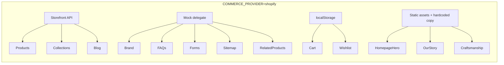
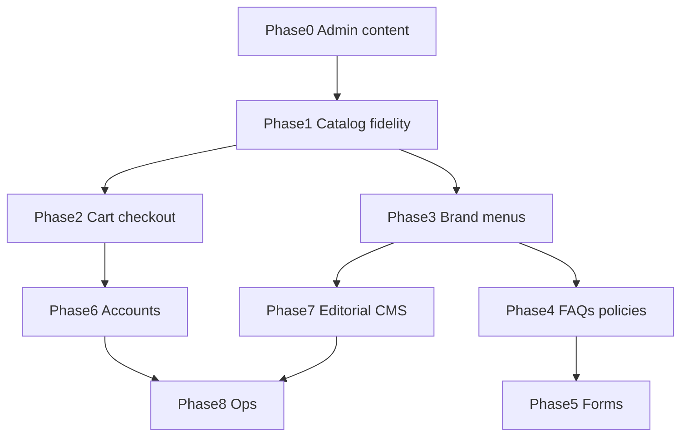

# Shopify-Driven Storefront Roadmap

Priority-ordered plan to move the GULRIZA Next.js headless storefront from mock/hardcoded content to **Shopify as the single source of truth** — catalog, navigation, brand, cart/checkout, CMS pages, and customer features.

Related docs:

- [Commerce layer](./commerce-layer.md) — architecture and env toggle
- [Shopify store setup](./shopify-store-setup.md) — tokens, CLI, verification

---

## How to update this document

When a phase (or sub-task) is finished:

1. Change **Status** from `pending` → `done` (or `in_progress` while active).
2. Add a **Completed** subsection under that phase with:
   - **Date** (YYYY-MM-DD)
   - **What was done** (bullets — Admin, app code, env)
   - **Verify** (commands or URLs checked)
3. If only part of a phase shipped, keep status `in_progress` and list done items under **Completed (partial)**.

Status values: `pending` | `in_progress` | `done`

---

## Progress at a glance

| Phase | Name | Status | Notes |
|-------|------|--------|-------|
| — | [Pre-roadmap infrastructure](#pre-roadmap-infrastructure) | **partial** | Connection + UX; not full Shopify catalog |
| 0 | [Foundation & content migration](#phase-0--foundation-and-content-migration) | pending | Admin catalog + metafield queries |
| 1 | [Catalog fidelity](#phase-1--complete-catalog-fidelity) | partial | Collection-scoped filters only |
| 2 | [Cart & checkout](#phase-2--cart-and-checkout) | pending | |
| 3 | [Brand, nav, footer](#phase-3--global-chrome-brand-nav-footer) | pending | |
| 4 | [FAQs & policies](#phase-4--trust-policies-and-faqs) | pending | |
| 5 | [Newsletter & contact](#phase-5--forms-newsletter-and-contact) | pending | |
| 6 | [Accounts & wishlist](#phase-6--customer-accounts-and-wishlist) | pending | |
| 7 | [Editorial CMS pages](#phase-7--editorial-cms-pages) | partial | Homepage collection blocks only |
| 8 | [Markets & operations](#phase-8--polish-and-operations) | pending | |

---

## Pre-roadmap infrastructure

**Status:** partial

Work completed before formal phase tracking (app + dev setup, not full Shopify content).

### Completed (partial)

- **Date:** 2026-06-19
- **What was done:**
  - Shopify Storefront API connected (`SHOPIFY_STORE_DOMAIN`, `SHOPIFY_STOREFRONT_ACCESS_TOKEN` in `.env.local`)
  - `pnpm verify:shopify` script ([`scripts/verify-shopify-connection.mjs`](../scripts/verify-shopify-connection.mjs))
  - [Shopify store setup guide](./shopify-store-setup.md)
  - Editorial homepage: stacked collection hero + product preview ([`HomeCollectionSections`](../src/components/site/HomeCollectionSections.tsx))
  - `/collections` redirects to `/#collections`; collection detail at `/collections/[slug]`
  - Mock catalog aligned to [purekashmir.com](https://purekashmir.com/) collections: Jamawar Embroidery, Kani Pashmina, Reversible Cashmere
  - Collection-scoped filters (color, price range from products on page)
- **Verify:** `pnpm dev:mock` for full UI; `pnpm verify:shopify` for API; `pnpm dev:shopify` (catalog empty until Phase 0 Admin content)

---

## Current state (baseline)

### On Shopify today (Storefront API)

- Products, collections, blog articles
- Search (products/collections)
- Homepage collection sections via [`getHomepageCollectionSections()`](../src/lib/commerce/homepage-collections.ts)

### Still mock / hardcoded

- Header/footer nav, brand, contact, SEO, social
- FAQs, newsletter, contact form
- Cart, checkout, wishlist, account
- Related products, sitemap (Shopify mode uses mock delegate)
- Product `colorHex` (not from variants)
- Collection hero metafields (`heroHeadline`, `tagline`, `ctaLabel`) — mock only
- Homepage main hero, marquee, legacy, quote
- Our Story, Craftsmanship pages
- PDP shipping/promise accordion copy

**Note:** `.env.local` uses `COMMERCE_PROVIDER=shopify`. Mock catalog is **not** in Shopify Admin yet — live mode shows an empty catalog until Phase 0 Admin work.

---

## What Shopify can drive vs what stays in Next.js

| Area | Drive from Shopify | Stays in Next.js |
|------|-------------------|------------------|
| Products | title, handle, description, images, price, variants, availability, tags, `productType`, metafields | PDP layout, accordions shell, JSON-LD template |
| Collections | title, handle, description, image, sort order, products | Hero/preview layout; metafields for extra hero lines |
| Filters (color/price) | variant options + prices from collection products | Filter UI in [`ProductListing`](../src/components/site/ProductListing.tsx) |
| Homepage collection blocks | collections + preview products | Main site hero, marquee, quote (until Phase 7) |
| Journal | blog articles, `bodyHtml`, images, tags | Index hero image; sidebar labels (map from tags in Phase 1) |
| Header / footer nav | [Menu API](https://shopify.dev/docs/api/admin-graphql/latest/queries/menus) | Header/Footer components |
| Brand | shop metafields + Files (logo) | Fonts, CSS, markup |
| Cart | [Storefront Cart API](https://shopify.dev/docs/api/storefront/latest/mutations/cartCreate) | [`CartDrawer`](../src/components/site/CartDrawer.tsx) UI |
| Checkout | `cart.checkoutUrl` → hosted checkout | Redirect only |
| Account / orders | Customer Account API | [`AccountClient`](../src/components/site/AccountClient.tsx) |
| FAQs | Metaobjects | Accordion UI |
| Our Story / Craftsmanship | Pages or Metaobjects | Page templates under `app/` |
| Sitemap / SEO | live handles + `NEXT_PUBLIC_SITE_URL` | `generateMetadata` templates |

**Cannot be Shopify-driven:** React layout, Tailwind, routes, filter UI logic, custom checkout UI.

---

## Shopify Admin setup (Phase 0 prerequisite)

Create in Admin (handles = URL slugs):

| Collection handle | Title |
|-------------------|-------|
| `jamawar-embroidery` | Jamawar Embroidery |
| `kani-pashmina` | Kani Pashmina |
| `reversible-cashmere` | Reversible Cashmere |

- Publish products to **Online Store / Headless**
- Blog handle: `news` (`SHOPIFY_BLOG_HANDLE`)
- **Collection metafields** (`custom`): `hero_headline`, `hero_tagline`, `cta_label`
- **Product metafields** (optional): `care_instructions`, `dimensions`
- **Variant option:** Color (for filter swatches in Phase 1)

### API access by phase

| Phase | API | Env var |
|-------|-----|---------|
| Catalog | Storefront | `SHOPIFY_STOREFRONT_ACCESS_TOKEN` |
| Menus, policies, metaobjects | Admin GraphQL | `SHOPIFY_ADMIN_ACCESS_TOKEN` |
| Customer login | Customer Account API | `SHOPIFY_CUSTOMER_ACCOUNT_CLIENT_ID` (+ secret, callback URLs) |

---

## Phase 0 — Foundation and content migration

**Status:** pending

**Goal:** Live Shopify store matches the editorial model; app reads real catalog data.

### Shopify Admin tasks

- [ ] Create 3 collections + flagship products (see mock in [`products.ts`](../src/lib/commerce/mock/data/products.ts))
- [ ] Upload collection hero images and product media
- [ ] Write collection descriptions (homepage hero + collection page)
- [ ] Create journal articles in blog `news`
- [ ] Define collection metafields in Admin
- [ ] Regenerate Storefront token if needed ([setup guide](./shopify-store-setup.md))

### App tasks

- [ ] Extend [`mapShopifyCollection`](../src/lib/commerce/shopify/mappers.ts) for metafields → `heroHeadline`, `tagline`, `ctaLabel`
- [ ] Add metafield fragments to [`queries.ts`](../src/lib/commerce/shopify/queries.ts)

### Verify

- `pnpm verify:shopify`
- `pnpm dev:shopify`
- Homepage `#collections`, `/collections/kani-pashmina` with live products

### Completed

_(none — update when Phase 0 is done)_

---

## Phase 1 — Complete catalog fidelity

**Status:** partial

**Goal:** Every catalog surface uses accurate Shopify data; no mock fallbacks on shopping paths.

### Tasks

| Task | Files | Shopify source |
|------|-------|----------------|
| Map variant colors to filters | `shopify/mappers.ts` | `product.options` / `selectedOptions` |
| Related products (not mock) | `shopify/provider.ts` | same collection / `productRecommendations` |
| Dynamic sitemap | `shopify/provider.ts` | live handles |
| `collectionSlug` on products | mappers | collection membership |
| `categoryLabel` from tags / `productType` | mappers | tags / productType |
| PDP metafields (care, dimensions) | `ProductClient.tsx`, queries | product metafields |
| Journal categories from tags | `JournalClient.tsx` | article tags |

### Completed (partial)

- **Date:** 2026-06-19
- **What was done:**
  - `deriveListingFacets()` — colors and price range derived from products on the current page
  - Collection pages: hide global category/collection filters; scope color + price to collection products
  - Default max price uses collection min/max (not global $1,000 cap)
- **Verify:** `pnpm dev:mock` → `/collections/kani-pashmina` shows collection-specific swatches and price slider

### Remaining

- Variant colors from Shopify (not mock `colorHex`)
- Related products, sitemap, metafields, journal tags (see table above)

---

## Phase 2 — Cart and checkout

**Status:** pending

**Goal:** Real bag → Shopify hosted checkout.

### Tasks

- [ ] Storefront Cart API (`cartCreate`, `cartLinesAdd`, `cartLinesUpdate`, `cartLinesRemove`)
- [ ] Persist `cartId` in httpOnly cookie
- [ ] Replace localStorage cart in [`commerce-context.tsx`](../src/lib/commerce/client/commerce-context.tsx) with `variantId` + line IDs
- [ ] Checkout button → `cart.checkoutUrl` in [`CartDrawer.tsx`](../src/components/site/CartDrawer.tsx)
- [ ] Server cart actions in `src/lib/commerce/shopify/cart.ts`
- [ ] Subtotal from cart `cost` fields

**Shopify scopes:** `unauthenticated_write_checkouts`, `unauthenticated_read_checkouts`

### Completed

_(none)_

---

## Phase 3 — Global chrome: brand, nav, footer

**Status:** pending

**Goal:** Header, footer, contact, SEO editable in Shopify without deploys.

| Surface | Shopify | App |
|---------|---------|-----|
| Header nav | Menu API | `getBrand()` via Admin API |
| Footer menus | Menus | `footerMenus` |
| Logo | Files + metafield | `brand.logo` |
| Name, tagline, contact, social, SEO | shop metafields | `BrandConfig` |
| Newsletter copy | shop metafields | `brand.newsletter` (submit in Phase 5) |

**Requires:** `SHOPIFY_ADMIN_ACCESS_TOKEN`, cache with `revalidate` (~300s)

Menu links must point to Next.js routes (`/shop`, `/#collections`, `/collections/...`), not theme URLs.

### Completed

_(none)_

---

## Phase 4 — Trust, policies, and FAQs

**Status:** pending

**Goal:** FAQs and legal/trust copy from Admin.

| Content | Shopify source | Consumer |
|---------|----------------|----------|
| FAQs | Metaobject `faq` | `/faqs`, `getFaqs()` |
| Shipping / returns | Shop policies | PDP accordions |
| Privacy / Terms | policies or Pages | Footer links |

### Completed

_(none)_

---

## Phase 5 — Forms: newsletter and contact

**Status:** pending

**Goal:** Submissions reach merchant workflows.

| Form | Options |
|------|---------|
| Newsletter | Admin `customerCreate` + marketing consent; Shopify Forms; Flow + Klaviyo/Mailchimp |
| Contact | Flow webhook; custom app email; third-party backend |

Wire [`subscribeNewsletterAction`](../src/lib/commerce/actions.ts) and `submitContactAction` in Shopify provider.

### Completed

_(none)_

---

## Phase 6 — Customer accounts and wishlist

**Status:** pending

**Goal:** Login, orders, saved items.

- OAuth PKCE (Customer Account API)
- Order history / profile
- Wishlist via customer metafield; guest localStorage until login

**Env (partial in `.env.local`):** `SHOPIFY_CUSTOMER_ACCOUNT_CLIENT_ID`, callback/logout URLs must match `NEXT_PUBLIC_SITE_URL`

Replace demo UI in [`AccountClient.tsx`](../src/components/site/AccountClient.tsx).

### Completed

_(none)_

---

## Phase 7 — Editorial CMS pages

**Status:** partial

**Goal:** Marketing copy and images editable in Shopify.

| Section | Approach |
|---------|----------|
| Homepage collection blocks | collections + products (**done** — Storefront) |
| Homepage main hero, marquee, legacy, quote | shop metaobjects |
| Our Story | Page `our-story` or metaobject |
| Craftsmanship | Page or metaobject (steps list) |
| Journal index hero | shop or blog metafield |

### Completed (partial)

- **Date:** 2026-06-19
- **What was done:**
  - Homepage `#collections` driven by `getHomepageCollectionSections()` (Shopify or mock)
  - `CollectionHero` + `CollectionPreview` components
- **Remaining:** Main hero above collections, Our Story, Craftsmanship, marquee/legacy blocks

---

## Phase 8 — Polish and operations

**Status:** pending

- Markets / multi-currency
- Predictive search
- Analytics / pixels
- Webhooks → `revalidateTag` on product/collection updates
- Inventory-aware sold-out badges
- B2B / wholesale (Shopify Plus, if needed)

### Completed

_(none)_

---

## Priority order

| Priority | Phase | Why |
|----------|-------|-----|
| 1 | 0 | Without Admin catalog, live site is empty |
| 2 | 1 | Shopping must match editorial model |
| 3 | 2 | Required to sell |
| 4 | 3 | Editable site chrome |
| 5 | 4 | Trust / legal |
| 6 | 5 | Lead capture |
| 7 | 6 | Retention |
| 8 | 7 | Long-form marketing pages |
| 9 | 8 | Scale and ops |

---

## Key decisions (record here when made)

| Decision | Choice | Date |
|----------|--------|------|
| CMS pattern | _Recommended: metaobjects for FAQs/blocks; Pages for Our Story_ | — |
| Admin API app | _Custom Admin app vs Partner `kashmir-weaver-probe`_ | — |
| Customer Account URLs | _Must match production `NEXT_PUBLIC_SITE_URL`_ | — |
| Mock mode | _Keep for CI/preview; `dev:shopify` is integration truth_ | 2026-06-19 |

---

## Suggested next sprint

1. **Phase 0** — Admin content + collection metafield queries
2. **Phase 1** — related products, sitemap, variant colors
3. **Phase 2** — Cart API + checkout redirect

Delivers a **sellable, Shopify-driven catalog** before CMS-heavy phases.
